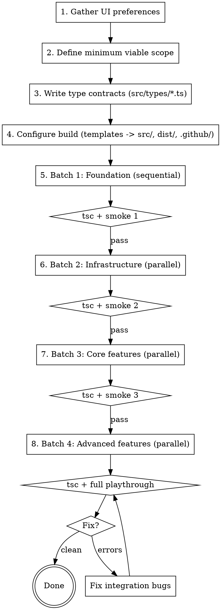

# Web Game Parallel Build

## Overview

**This skill exists to cut wall-clock time.** It builds a TypeScript
browser game from modular `src/` files using parallel coding subagents
with batched integration checkpoints, so an entire playable game (or
major fix) can ship inside a live podcast, classroom demo, or
livestream window. The audience watches the game come up at
`http://localhost:<port>/` from `run_web_server.sh` during the show;
that local preview is the immediate live target. GitHub Pages and the
optional single-file export are post-show release paths, not the
artifact the audience watches you build.

Without the wall-time constraint this skill would not exist -- a
serial agent with TDD produces cleaner output for the same total
cost. The whole point is to hit the deadline.

The skill hits the deadline AT the quality bar, not at the cost of
it. Every rule that looks like rigor (typed cross-module contracts,
smoke tests between batches, exact `tsc --noEmit` output in subagent
reports, pause-and-invoke for type design) is there because it saves
time at the end: 30 seconds of contract discipline per agent
prevents 30 minutes of integration debugging in a 14-module pile at
the boundary. Cutting any of these rules to "save time" moves the
same time into integration debt and blows the window.

Mechanism: parallel coding subagents coordinated by an orchestrator
around shared contracts and batched integration checkpoints. The
orchestrator does NOT write game code (except Batch 1 foundation).
It gathers requirements, writes type contracts, dispatches coding
agents in parallel, runs smoke tests, and fixes integration issues.
Type design lives in `typescript-engineer`; this skill does not
restate any TypeScript rules.

## Required upstream skills

Invoke these; do not hand-roll their work here.

- `typescript-engineer` (this repo) owns all type design. Route to
  `typescript-engineer/references/game-type-patterns.md` for branded
  ids, save-file boundary, `GameEvent` unions, ECS shapes, and
  `as const satisfies` config tables;
  `typescript-engineer/references/modular-type-design.md` for
  feature-area ownership;
  `typescript-engineer/references/strict-mode-flags.md` for strict
  posture.
- `delegate-manager-to-subagents` owns manager dispatch: read-only
  manager review, subagent ownership boundaries, evidence-first
  handoff. Invoke before dispatching any coding subagent.
- `parallel-plan` owns the up-front decision of how many lanes to
  split into and when one agent should hand off rather than carry
  everything. Invoke once before Batch 1; revisit if a batch becomes
  lopsided.

## What this skill owns

- The preassigned workstream layout for browser games.
- The `src/` module decomposition.
- The build identity split (GitHub Pages default vs. single-file
  export) -- summary below; detail in
  [`references/BUILD_ARTIFACTS.md`](references/BUILD_ARTIFACTS.md).
- Web-platform gotchas (canvas + `innerHTML`, branded ids leaking to
  DOM, type-only imports under `verbatimModuleSyntax`) -- detail in
  [`references/SMOKE_AND_GOTCHAS.md`](references/SMOKE_AND_GOTCHAS.md).
- Playwright smoke testing between batches -- detail in
  [`references/SMOKE_AND_GOTCHAS.md`](references/SMOKE_AND_GOTCHAS.md).
- Shipped script artifacts under `templates/` -- inventory in
  [`references/BUILD_ARTIFACTS.md`](references/BUILD_ARTIFACTS.md).

## Build identity

Default to a GitHub Pages-ready TypeScript browser game that builds
into `dist/`. Use the single-file HTML export only when the user
explicitly asks for a portable file. The three driver scripts have
distinct, non-overlapping jobs: `run_web_server.sh` for the live
preview, `build_github_pages.sh` for the canonical `dist/` build, and
`export_single_file.sh` for the optional `dist-single/` artifact. Do
not blend them. Full per-script constraints and the shipped-artifact
inventory in
[`references/BUILD_ARTIFACTS.md`](references/BUILD_ARTIFACTS.md).

## Terminology

Canonical definitions live in
[`references/DEFINITIONS.md`](references/DEFINITIONS.md). Naming
constraints and legacy handling live in
[`references/NAMING_GUARDRAILS.md`](references/NAMING_GUARDRAILS.md).
Capacity and sizing targets live in
[`references/CAPACITY_AND_SIZING.md`](references/CAPACITY_AND_SIZING.md).

Use Milestone / Workstream / Work package only in planning docs, not
in durable code identifiers. Use Stage / Pass / Step for durable
gameplay pipeline or algorithm steps in code identifiers. If a
repository already has `phaseN_*` artifacts, treat that as legacy
naming and do not introduce new planning-phase names into code.

## Preassigned workstreams

Use these defaults unless project requirements force a different
split. Lane count, scope splits, and merges go through `parallel-plan`
before Batch 1.

- Workstream A0: Types and contracts
  - Files: `src/types/*.ts`, `src/brands.ts`
  - Owner: orchestrator (or a dedicated agent before Batch 1)
  - Goal: cross-workstream contracts so all later batches can compile
    in isolation.
- Workstream A: Foundation and state
  - Files: `src/constants.ts`, `src/characters.ts`, `src/game_state.ts`
  - Goal: stable contracts and stage/state backbone.
- Workstream B: UI shell and styling
  - Files: `src/head.html`, `src/body.html`, `src/tail.html`,
    `src/index.html`, `src/style.css`, `src/ui_rendering.ts`
  - Goal: interaction shell, layout, and shared UI controls.
- Workstream C: Core gameplay stage
  - Files: `src/scene_stage.ts`, `src/data_generation.ts`
  - Goal: core playable loop with contract-conformant data.
- Workstream D: Advanced gameplay and outcomes
  - Files: `src/lab_stage.ts`, `src/gel_rendering.ts`,
    `src/case_board.ts`, `src/scoring.ts`, `src/educational.ts`
  - Goal: analysis/review stages, scoring, and endgame flow.
- Workstream E: Runtime utilities
  - Files: `src/timer.ts`, `src/save_load.ts`, `src/init.ts`
  - Goal: lifecycle bootstrap, persistence, timers.

## When to use

- Building a TypeScript browser game in a time-pressured live context
  (podcast, classroom demo, livestream) where wall-clock time matters
  more than strict serial discipline.
- Multiple subagents will write `.ts`, CSS, and HTML concurrently.
- The app has interacting modules (data generation, display, user
  interaction).
- Canvas rendering is involved (gel visualizations, charts, game
  graphics).
- The release target is GitHub Pages (default) or a portable single
  HTML file (optional export).

## When NOT to use

- Simple single-file edits.
- Server-side applications.
- Multi-page apps with heavy build tooling beyond `tsc` + `esbuild`
  (Vite, Webpack, Next, etc.).
- Tasks where one subagent can finish in under 10 minutes; the
  parallelization overhead is not worth it.
- Off-stage work where wall-clock minutes are not a constraint -- a
  serial agent with TDD will produce cleaner output for the same
  total cost.

## The process

## Step list

Each step's full body lives in
[`references/STEP_DETAILS.md`](references/STEP_DETAILS.md). Steps 1-4
and Step 6 expand there; Step 5 has its own dispatch tables in
[`references/BATCH_DISPATCH.md`](references/BATCH_DISPATCH.md).

1. **Gather UI preferences** (~2 min). Buttons vs dropdowns, theme,
   mobile support, references. Ask before writing code.
2. **Define minimum viable scope.** 1-2 mechanics, 1-2 content types,
   fixed difficulty, no save/load in first pass. Defer features that
   come after the core loop.
3. **Write type contracts** (~5-10 min, sequential). Real `.ts` files
   under `src/types/`, imported with `import type`, extensionless
   paths. `npx tsc --noEmit -p src/tsconfig.json` passes before any
   batch is green. See
   [`references/STEP_DETAILS.md`](references/STEP_DETAILS.md).
4. **Configure the build** (~2-3 min, sequential). Copy templates,
   set executable bits, place tsconfig, install the GitHub Actions
   workflow. See
   [`references/STEP_DETAILS.md`](references/STEP_DETAILS.md).
5. **Batched agent dispatch.** Four batches: Batch 1 foundation
   (sequential), Batches 2-4 parallel. Per-batch agent files, type
   imports, prompt-must-include block, and total wall-clock numbers
   in [`references/BATCH_DISPATCH.md`](references/BATCH_DISPATCH.md).
   Manager dispatch follows `delegate-manager-to-subagents`.
6. **Integration fix loop.** After the final smoke, if Playwright
   finds errors: console messages, snapshot, identify the broken
   module, dispatch a small fix agent, rebuild, re-test. See
   [`references/STEP_DETAILS.md`](references/STEP_DETAILS.md).

## Smoke testing

Run a Playwright smoke after each batch. Recipe and the pre-smoke
`tsc` gate live in
[`references/SMOKE_AND_GOTCHAS.md`](references/SMOKE_AND_GOTCHAS.md);
that file also carries the web-platform gotchas table read between
batches when something breaks.

When a smoke test fails, fix the failing module before proceeding to
the next batch. If the failure is a contract violation, update
`src/types/` and re-run `tsc` before re-dispatching agents -- all
subsequent agents need the corrected contract. This is load-bearing:
proceeding past a failing smoke compounds bugs across batches.

## Critical guardrails

The full guardrails set, the bottleneck rationale, the rationalization
table, and the common-mistakes prose live in
[`references/QUALITY_GUARDRAILS.md`](references/QUALITY_GUARDRAILS.md).
The load-bearing rules below stay inline because the skill fails
without them:

- No coding agents dispatched before contracts are written.
- No batch declared green without `npx tsc --noEmit` passing.
- No skipping the smoke test between batches.
- No `as` cast outside a brand constructor or save-file type guard;
  route the problem to `typescript-engineer`.
- The manager does not write game code except Batch 1.
- A coding subagent that needs a cross-module type pauses, invokes
  `typescript-engineer` for the typed stub, and waits before
  resuming -- it does not redeclare the shape locally to keep
  moving. Full delegation contract in
  [`references/BATCH_DISPATCH.md`](references/BATCH_DISPATCH.md).
- Every subagent report quotes the exact `npx tsc --noEmit` command
  and its exact success line (`exit 0`, no diagnostic output);
  "all green" without that evidence is treated as a false-green
  claim and re-dispatched.

## Agent prompt template

Use [`templates/agent_prompt_template.md`](templates/agent_prompt_template.md)
for every coding subagent. The template adds these web-game-specific
rules on top of the manager dispatch contract from
`delegate-manager-to-subagents`:

- Files are `.ts`. Use ES `import` / `export` for everything.
- Imports are extensionless.
- Import contract types from `src/types/*.ts` using
  `import type { ... }`.
- Do not redefine cross-module shapes locally.
- Zero unchecked `as` casts (brand constructors and save-file type
  guards excepted; see
  `typescript-engineer/references/opaque-types.md`).
- Run `npx tsc --noEmit -p src/tsconfig.json` before reporting done.

For type-design help, the agent invokes `typescript-engineer` and
follows its decision tree. Game-shape questions start at
`typescript-engineer/references/game-type-patterns.md`.

## Subagent dispatch

Dispatch a fresh subagent for each atomic task. Reusing a subagent
across tasks carries stale context, encourages drift, and weakens
independent judgment. `SendMessage` is for status only; do not use it
to chain follow-on editing work onto a teammate that has already
finished its assigned task. See `docs/REPO_STYLE.md`.
