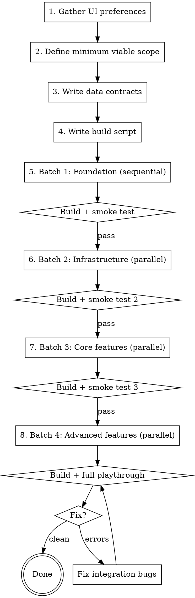

# Parallel Web Game Build

## Overview

Build a single-file web game (or interactive web app) from modular source files using parallel agents with batched integration checkpoints. The output is one self-contained HTML file assembled from `parts/` via a build script.

**Core principle:** Contracts before code, batches before integration, browser testing before declaring done.

**Orchestrator role:** The lead agent does NOT write game code (except Batch 1 foundation). It gathers requirements, writes contracts, dispatches coding agents in batches, runs smoke tests, and fixes integration issues.

**Relationship to manager planning:** This skill is a domain-specific implementation profile of `manager-make-new-plan` for single-file web games. It keeps the same milestone/workstream/work-package/patch model, but preassigns standard workstreams so execution can start faster with less planning overhead.

## Terminology Contract

Canonical definitions live in `references/DEFINITIONS.md`.
Naming constraints and legacy handling live in `references/NAMING_GUARDRAILS.md`.
Capacity and sizing targets live in `references/CAPACITY_AND_SIZING.md`.

## Terminology Collision

- Use Milestone / Workstream / Work package only in planning docs, not in durable code identifiers.
- Use Stage / Pass / Step for durable gameplay pipeline or algorithm steps in code identifiers.
- If a repository already has `phaseN_*` artifacts, treat that as legacy naming and do not introduce new planning-phase names into code.

## Preassigned Workstreams

Use these default workstreams unless project requirements force a different split:

- Workstream A: Foundation and state
  - Files: `constants.js`, `characters.js`, `game_state.js`
  - Goal: stable contracts and stage/state backbone
- Workstream B: UI shell and styling
  - Files: `head.html`, `body.html`, `tail.html`, `style.css`, `ui_rendering.js`
  - Goal: interaction shell, layout, and shared UI controls
- Workstream C: Core gameplay stage
  - Files: `scene_stage.js`, `data_generation.js`
  - Goal: core playable loop with contract-conformant data
- Workstream D: Advanced gameplay and outcomes
  - Files: `lab_stage.js`, `gel_rendering.js`, `case_board.js`, `scoring.js`, `educational.js`
  - Goal: analysis/review stages, scoring, and endgame flow
- Workstream E: Runtime utilities
  - Files: `timer.js`, `save_load.js`, `init.js`
  - Goal: lifecycle bootstrap, persistence, and timers

When available agents are fewer than workstreams, merge adjacent workstreams and keep ownership explicit.
When available agents exceed workstreams, split the largest workstream into work packages, not ad-hoc files.

## When to Use

- Building a single HTML file from modular source files
- Multiple agents will write JavaScript/CSS/HTML concurrently
- The app has interacting modules (data generation, display, user interaction)
- Canvas rendering is involved (gel visualizations, charts, game graphics)

## When NOT to Use

- Simple single-file edits
- Server-side applications
- Multi-page web apps with build tooling (webpack, vite)
- Tasks where one agent can finish in under 10 minutes

## The Process



## Step 1: Gather UI Preferences (2 min)

**Before writing any code**, ask the user about interaction style:

- Buttons vs dropdowns vs drag-and-drop?
- Dark theme vs light?
- Mobile support needed?
- Any visual references or screenshots?

**You must actually ask.** Do not default to buttons (or any style) without confirmation. The agent prompt template includes a default, but that default exists as a fallback - it does not replace asking.

**Why:** A 2-minute conversation saves a 30-minute rewrite. The DNA forensics build required a near-complete rewrite of the lab stage because agents built dropdowns and the user wanted buttons.

## Step 2: Define Minimum Viable Scope

Start small. Get the core loop working end-to-end before expanding.

**Template:**
- 1-2 core mechanics (not 5)
- 1-2 content types (not 5)
- Fixed difficulty (not 3 levels)
- No save/load in first pass

**Why:** The DNA forensics build started with 5 forensic test types and had to cut to 2 after integration failure. Starting with 2 and expanding later would have been faster overall.

**Rule:** If a feature can be added after the core loop works, defer it.

## Step 2b: Decompose into Modules

Break the game into files in `parts/`. Use this proven 18-file template as a starting point, then adapt per project:

```
parts/
  head.html            DOCTYPE, meta, title
  style.css            All CSS
  body.html            DOM structure (screens, panels, modals)
  tail.html            Closing tags
  constants.js         Game config, data definitions, room/level data
  characters.js        Entity definitions with game-relevant attributes
  data_generation.js   Randomized content, puzzle/test result generators
  game_state.js        State machine, stage transitions, round management
  scene_stage.js       Stage 1 gameplay UI (e.g. exploration, collection)
  lab_stage.js         Stage 2 gameplay UI (e.g. analysis, testing)
  gel_rendering.js     Canvas rendering (if needed)
  case_board.js        Stage 3 gameplay UI (e.g. review, decision, endgame)
  scoring.js           Scoring engine
  educational.js       Help content, tooltips, explanations
  ui_rendering.js      Setup screen, modals, notifications, shared UI
  timer.js             Countdown/timer mechanics
  save_load.js         localStorage persistence
  init.js              Bootstrap, keyboard shortcuts, DOMContentLoaded
```

**How to adapt per project:**

Not every game needs all 18 files. Map the template to your game:

- **Always keep:** `head.html`, `body.html`, `tail.html`, `style.css`, `constants.js`, `game_state.js`, `init.js`
- **Rename stage files** to match your game loop (e.g. `scene_stage.js` becomes `question_stage.js`, `puzzle_stage.js`, etc.)
- **Keep if applicable:** `characters.js` (entities), `data_generation.js` (randomized content), canvas rendering (rename to match), `scoring.js`, `educational.js`
- **Defer to post-MVP:** `save_load.js`, `timer.js`, `educational.js` (keep scope minimal if included)

**Estimate module complexity before proceeding:**

| Signal | Action |
| --- | --- |
| 4+ content types in one module | Split into separate files or reduce scope |
| Multiple distinct UI screens | Split by screen |
| Both data generation AND display | Split generator from renderer |
| Over ~400 lines expected | Find a split point |

A batch finishes as fast as its slowest agent. Complex modules bottleneck the entire batch.

## Step 3: Write Data Contracts (5-10 min, SEQUENTIAL)

**This is the most important step.** Write contracts BEFORE dispatching any coding agents.

The contracts document can be a Markdown file (e.g. `parts/CONTRACTS.md`), a comment-only JS file, or inline in the plan document. The format does not matter. What matters is that every cross-module interface is specified with exact property names and types.

Write the contracts document specifying:

1. **Function return shapes** - exact property names and types for every generator function
2. **Function signatures** - parameters and expected types for every cross-module call
3. **DOM element IDs** - every ID that one module creates and another reads
4. **Global state shape** - the game state object structure
5. **Event flow** - which functions call which, in what order

**Example contract (blood typing):**
```javascript
// generateBloodTypeResult(sample, sourceCharacter) returns:
// {
//   bloodType: string,     // "A", "B", "AB", or "O" (no Rh suffix)
//   rhFactor: string,      // "+" or "-"
//   agglutination: {       // visual display data
//     antiA: boolean,
//     antiB: boolean,
//     antiD: boolean
//   }
// }
//
// displayBloodTypeResult() reads: result.bloodType, result.rhFactor,
//   result.agglutination.antiA, result.agglutination.antiB, result.agglutination.antiD
```

**Example contract (RFLP):**
```javascript
// generateRFLPResult(sample, sourceCharacter, enzyme?) returns:
// {
//   enzyme: string,           // single enzyme name, e.g. "EcoRI"
//   fragments: number[],      // fragment sizes in bp, e.g. [1200, 3400, 5600]
//   degraded: boolean
// }
//
// displayRFLPResult() reads: result.enzyme, result.fragments
// renderGel() expects lanes: [{label: string, fragments: number[]}]
```

**Why:** In the DNA forensics build, every single test type had a data structure mismatch between generator and display. `generateTestResult()` nested under `result.data`, displays read flat properties. `generateRFLPResult()` returned all enzymes, display expected one. This consumed 60+ minutes of debugging. A 10-minute contracts doc would have prevented all of it.

## Step 4: Write Build Script (sequential, 2 min)

Create the build script that concatenates `parts/` into the final HTML file. This runs in the orchestrator context before dispatching agents.

```bash
#!/bin/bash
# build_game.sh - concatenate parts into single HTML file
cat parts/head.html > output.html
echo "<style>" >> output.html
cat parts/style.css >> output.html
echo "</style>" >> output.html
echo "<body>" >> output.html
cat parts/body.html >> output.html
echo "<script>" >> output.html
cat parts/constants.js parts/characters.js parts/data_generation.js \
    parts/game_state.js parts/timer.js parts/scene_stage.js \
    parts/lab_stage.js parts/gel_rendering.js parts/case_board.js \
    parts/scoring.js parts/educational.js parts/ui_rendering.js \
    parts/save_load.js parts/init.js >> output.html
echo "</script>" >> output.html
cat parts/tail.html >> output.html
```

## Step 5: Batched Agent Dispatch

Before dispatching, map each batch assignment to one of the preassigned workstreams above and keep owner continuity across batches where possible.

### Batch 1: Foundation (sequential, ~2 min)

Write in the orchestrator or a single agent:
- `constants.js` - game config, test definitions, room data
- `characters.js` - character pool with biological profiles
- `game_state.js` - state machine, stage transitions

**These define the data model everything else depends on.** They MUST reference the contracts.

**Smoke test:** Build and open in browser. Verify no JS errors.

### Batch 2: Infrastructure (parallel, ~4 min)

Dispatch agents in parallel, each owning specific files:

| Agent | Files | Notes |
| --- | --- | --- |
| Styling | `style.css`, `head.html`, `body.html`, `tail.html` | All HTML structure + CSS |
| Timer + utilities | `timer.js`, `save_load.js` | No cross-module UI |
| UI rendering | `ui_rendering.js` | Setup screen, modals, notifications |

**Each agent prompt MUST include:**
- The full contracts document
- The constants.js and game_state.js content (or key excerpts)
- Their owned files (no other files)
- Explicit constraint: "Do NOT modify files outside your assignment"

**Smoke test:** Build, open in browser, verify skeleton loads, state machine transitions work, timer displays.

### Batch 3: Core game stages (parallel, ~5 min)

| Agent | Files | Notes |
| --- | --- | --- |
| Scene stage | `scene_stage.js` | Evidence collection UI |
| Data generation | `data_generation.js` | Test result generators per contracts |

**Smoke test:** Build, verify evidence collection works end-to-end via Playwright.

### Batch 4: Advanced features (parallel, ~5 min)

| Agent | Files | Notes |
| --- | --- | --- |
| Lab + gel | `lab_stage.js`, `gel_rendering.js` | Test running, canvas visualization |
| Case board + scoring + educational | `case_board.js`, `scoring.js`, `educational.js` | Endgame flow |

**Smoke test:** Build, full playthrough via Playwright from title to game over.

### Total wall-clock: ~20 min with 4 integration checkpoints

Compare: all-at-once parallel (8 min authoring + 60 min debugging = 68 min).

## Step 6: Integration Fix Loop

After the final smoke test, if Playwright finds errors:

1. Check `browser_console_messages` for JS errors
2. Take a browser snapshot to see DOM state
3. Identify which module(s) are broken
4. Dispatch a fix agent with the specific error message and the relevant module code
5. Rebuild and re-test

Repeat until clean. The fix scope should be small (1-2 modules) if contracts were followed.

## Agent Prompt Template

Every coding agent gets this structure:

```
## Your Assignment
Files you own: [list]
DO NOT create or modify any other files.

## Data Contracts
[paste full contracts document]

## Foundation Code
[paste constants.js, characters.js, game_state.js - or key excerpts]

## Web Platform Rules
- After setting innerHTML on a container with a <canvas>, wrap any
  canvas drawing calls in requestAnimationFrame:
    display.innerHTML = html;
    requestAnimationFrame(function() {
        renderCanvas('canvas-id', data);
    });
- Use button-based UI for user choices (not dropdowns or textareas)
  unless the user specified otherwise
- All code runs in a single <script> block - no modules, no imports
- No external dependencies - everything inline

## Your Task
[specific instructions for this agent's module]
```

## Smoke Testing with Playwright

After each batch, run a Playwright smoke test:

1. Start a local HTTP server: `python3 -m http.server 8000 &`
2. Navigate to the built HTML file
3. Take a snapshot, check for expected DOM elements
4. Click through the current game flow
5. Check `browser_console_messages` for zero JS errors (ignore favicon 404)
6. Close browser, kill server

**Critical:** Do not skip smoke tests between batches. The whole point of batching is to catch integration bugs early when they are cheap to fix (1-2 modules to check) rather than late (14 modules to debug).

**When a smoke test fails:** Fix the failing module before proceeding to the next batch. The fix scope is small (only modules from the current and previous batches exist). If the failure is a contract violation, update the contracts document before dispatching the next batch - all subsequent agents need the corrected contract.

## Web Platform Gotchas

Include these in every agent prompt to prevent known issues:

| Gotcha | Fix |
| --- | --- |
| Canvas blank after innerHTML | Wrap render calls in `requestAnimationFrame` |
| Canvas zero size | Set width/height attributes on `<canvas>`, not just CSS |
| onclick not firing | Verify element exists in DOM before attaching handler; prefer `addEventListener` |
| Global name collision | Use unique function names across all modules (no generic `init()`, `render()`) |
| Concatenation order matters | Functions must be defined before they are called in the concatenated output |

## Bottlenecks and Mitigation

Four sequential steps gate the parallel work. Each one is mandatory but can be shortened.

| Bottleneck | Time | Why sequential | Mitigation |
| --- | --- | --- | --- |
| UI preference interview | ~2 min | Must happen before any code | Prepare a short checklist (buttons/dropdowns, theme, mobile). Ask before opening the repo. |
| Data contracts | ~5-10 min | Every agent needs the contracts before writing code | Reuse contract templates from prior builds. Keep contracts to minimum viable scope only - do not write contracts for deferred features. |
| Batch 1 foundation | ~2 min | Constants, characters, and game state define the data model all other modules depend on | Keep Batch 1 to 3 files max. Write only the data model and state machine - no UI, no game logic. |
| Smoke tests between batches | ~2 min each, 4 total | Each batch must pass before the next starts | Keep smoke tests tight: build, load page, check console errors, click one element. Save full playthroughs for the final batch only. Reuse a Playwright smoke test script across batches. |

**The hidden bottleneck is skipping these steps.** Without contracts, debugging mismatches cost 60+ minutes. Without batching, all bugs surface at the end in a 14-module pile. The sequential gates are faster than the alternative.

**Where time is NOT a bottleneck:** Agent authoring within a batch is fully parallel. 6 agents writing 14 files in 4 batches takes ~15 min of agent wall-clock time. The sequential overhead (contracts + smoke tests) adds ~15 min. Total: ~30 min. Compare to all-at-once: 8 min authoring + 60 min debugging = 68 min.

### Independent component testing

Modules should be testable in isolation, without waiting for integration. Each agent should deliver a module that can run with stub dependencies.

**How:** Each agent's prompt includes instructions to write their module so it degrades gracefully when other modules are absent. For example:
- A display function should render something when called with hardcoded test data, even if the generator module does not exist yet.
- A data generator should be callable from the browser console with test inputs, even if no UI exists to trigger it.

**Practical pattern:** After each agent finishes, verify the module in isolation before the batch smoke test:

```javascript
// Drop into browser console after building with just this module + foundation
// Test data_generation.js independently:
var sample = {type: 'blood', quality: 'pristine'};
var character = gameState.suspects[0];
var result = generateBloodTypeResult(sample, character);
console.log(result.bloodType, result.rhFactor);  // should print e.g. "A" "+"
```

This catches internal bugs (wrong property names, missing returns) before integration, when the fix scope is one file instead of fourteen.

### Complex module detection and splitting

**A batch finishes as fast as its slowest agent.** If one module is significantly more complex than its batch-mates, it becomes the bottleneck for the entire batch.

**Before dispatching a batch, estimate relative complexity:**

| Signal | Likely complex |
| --- | --- |
| Multiple content types (help topics, tooltips, explanations, summaries) | Yes - split by content type |
| More than 2 distinct UI screens or flows | Yes - split by screen |
| Both data generation AND display logic | Yes - split generator from renderer |
| Over ~400 lines expected | Yes - find a split point |

**When you identify a complex module, you have two options:**

1. **Split it into smaller files** that can be assigned to separate agents within the same batch. Example: instead of one `educational.js` handling help topics, tooltips, test explanations, and end-game summaries, split into `educational_help.js` (help topic content) and `educational_display.js` (rendering and tooltip logic).

2. **Reduce scope for first pass.** Ship the simple version in the current batch, expand later. Example: educational content for 2 test types instead of 5, plain text tooltips instead of rich HTML popups.

**Prefer option 2 (reduce scope) over option 1 (split files) when possible.** Splitting adds coordination overhead. Reducing scope removes work entirely.

**Real example:** The DNA forensics build had `educational.js` (~771 lines) covering help topics for 5 test types, concept tooltips, test result explanations, and end-game forensic science summaries. This was the slowest agent in its batch and held up the entire wave. Better approach: first pass covers help topics for 2 test types only, no tooltips, no end-game summary. Add the rest after the core loop works.

## Rationalization Table

| Excuse | Reality |
| --- | --- |
| "Contracts take too long" | 10 min contracts vs 60 min debugging mismatches. Not negotiable. |
| "We can fix integration later" | Integration bugs compound. 2 mismatched modules = 1 fix. 14 mismatched modules = 20 fixes. |
| "Let's add all features now" | Get 2 working before adding 3 more. Scope creep killed the first build. |
| "Smoke tests slow us down" | 2 min smoke test catches bugs worth 30 min of debugging. |
| "Agents can figure out the interface" | They cannot. Every generator/display pair mismatched without contracts. Every single one. |
| "I'll ask about UI preferences after" | UI rewrite cost 30 min. Asking first costs 2 min. |
| "requestAnimationFrame is optional" | Canvas will be blank. This is not optional. |
| "All agents can run at once" | Foundation agents must finish first. Batching is the whole point. |
| "One agent can handle this big module" | A batch finishes as fast as its slowest agent. Split or scope-reduce complex modules. |
| "We'll test it all together at the end" | Test each module in isolation first. Console-level checks catch bugs before integration. |

## Red Flags - STOP

- Dispatching coding agents before contracts are written
- Skipping a smoke test between batches
- Adding features beyond the minimum viable scope in batch 3-4
- Agent prompts that don't include the contracts document
- Two agents assigned to the same file
- No Playwright browser testing planned
- Skipping UI preference gathering
- One agent assigned a module with 4+ content types or 400+ expected lines without splitting or scope-reducing
- No plan for testing modules independently before integration

## Common Mistakes

**Flat vs nested data:** Generators return `{enzyme: "EcoRI", fragments: [...]}`. Do not nest: `{data: {enzyme: "EcoRI", fragments: [...]}}`. Flat properties are what display functions will read.

**Scope creep in contracts:** Only write contracts for features in the minimum viable scope. Do not write contracts for deferred features.

**Canvas in innerHTML:** Always use `requestAnimationFrame` after `innerHTML` that creates a canvas. Always set canvas `width` and `height` as element attributes. This is the #1 rendering bug in single-file web apps.
