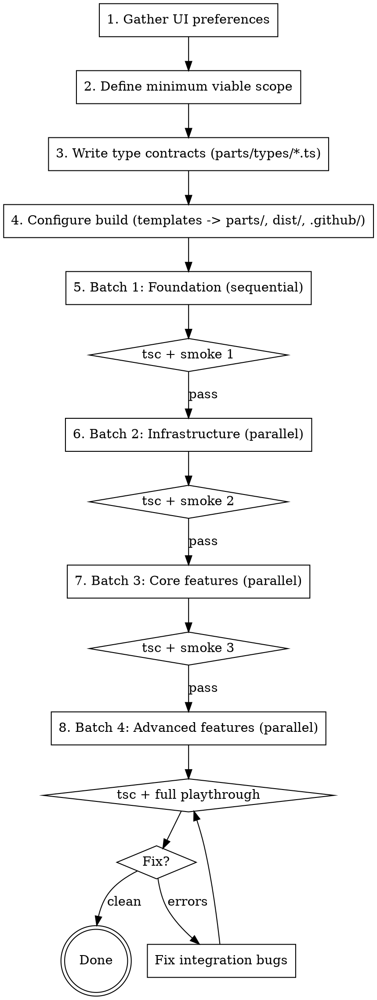

# Web Game Parallel Build

## Overview

Build a TypeScript browser game from modular source files in `parts/` using
parallel coding subagents with batched integration checkpoints. The default
release target is a GitHub Pages-ready `dist/` produced by
`build_github_pages.sh`; an optional one-file HTML export is available via
`export_single_file.sh` when the user explicitly asks for portable sharing.

**Why this skill exists:** two co-primary goals, one mechanism.

- Goal 1 -- ship good code: typed cross-module contracts, isolated
  feature-area modules, smoke-tested integration, and a strict
  TypeScript posture (`tsc --noEmit`, `noUncheckedIndexedAccess`,
  `exactOptionalPropertyTypes`, no unchecked `as` casts).
- Goal 2 -- cut wall-clock time enough to finish a playable web game
  inside a live/podcast/classroom-demo/livestream window where serial
  implementation would not. The immediate target during the live
  window is the locally-served preview from `run_web_server.sh`, not
  the GitHub Pages deploy. GitHub Pages (and the optional single-file
  export) are post-show release paths, not the artifact the audience
  watches you build.
- Mechanism: parallel coding subagents coordinated by an orchestrator
  around shared contracts and batched integration checkpoints.

Contracts, batches, smoke tests, and the build-identity split serve
BOTH goals -- they keep parallel output safe to merge AND keep the
resulting code good. Neither goal subsidizes the other: speed is not
an excuse to drop the quality bar, and the quality bar is not an
excuse to abandon parallelism and miss the window.

**Core principle:** Contracts before code, batches before integration,
browser testing before declaring done. Parallel agents are how we hit
the deadline without giving up the quality bar.

**Orchestrator role:** The lead agent does NOT write game code (except
Batch 1 foundation). It gathers requirements, writes type contracts,
dispatches coding agents in batches, runs smoke tests, and fixes integration
issues.

Type design lives in `typescript-engineer`. This skill does not restate any
TypeScript rules.

## Required upstream skills

This skill requires three upstream skills. Invoke them; do not hand-roll
their work here.

- `typescript-engineer` (this repo, `skills/typescript-engineer/`) owns all
  type design. Route to:
  [`references/game-type-patterns.md`](../typescript-engineer/references/game-type-patterns.md)
  for branded ids, save-file boundary, `GameEvent` unions, ECS shapes,
  and `as const satisfies` config tables;
  [`references/modular-type-design.md`](../typescript-engineer/references/modular-type-design.md)
  for feature-area ownership;
  [`references/strict-mode-flags.md`](../typescript-engineer/references/strict-mode-flags.md)
  for strict posture.
- `superpowers:subagent-driven-development` owns parallel dispatch and
  integration mechanics: ownership boundaries, dispatch hygiene,
  per-task review, integration after each batch. Invoke before
  dispatching any coding subagent. This skill only adds the web-game
  specifics on top.
- `parallel-plan` owns the up-front decision of how many lanes to split
  into and when one agent should hand off rather than carry everything.
  Invoke once before Batch 1; revisit if a batch becomes lopsided.

## What this skill still owns

- The preassigned workstream layout for browser games.
- The `parts/` module decomposition.
- The build identity split (GitHub Pages default vs. single-file export).
- Web-platform gotchas (canvas + `innerHTML`, branded ids leaking to DOM,
  type-only imports under `verbatimModuleSyntax`).
- Playwright smoke testing between batches.
- Shipped script artifacts under `templates/` (see "Shipped artifacts"
  below).

## Build identity

Default to a GitHub Pages-ready TypeScript browser game that builds into
`dist/`. Use the single-file HTML export only when the user explicitly
asks for a portable file, offline sharing, email attachment, or archive
build. Prefer GitHub Actions for deployment. Do not make agents manually
copy `dist/` to a branch unless the user explicitly asks for branch-based
deployment.

The three driver scripts have distinct, non-overlapping jobs:

- `run_web_server.sh`: local development preview. **This is the
  immediate live/podcast/demo target** -- the audience watches the
  game come up at `http://localhost:<port>/` from this script.
- `build_github_pages.sh`: canonical production build to `dist/`.
  Post-show release path. Must NOT produce single-file output.
- `export_single_file.sh`: optional portable artifact to `dist-single/`.
  Post-show portable-sharing path. Must NOT mutate `dist/`.

## Shipped artifacts

The skill ships real files under `templates/` an orchestrator can copy
verbatim:

- `templates/setup_game.sh` -- one-time `npm install` + initial build.
- `templates/setup_playwright.sh` -- one-time Playwright + chromium
  install (separate from `setup_game.sh` because the chromium download
  is heavier and may be skipped on machines that already have it).
- `templates/run_web_server.sh` -- local dev preview.
- `templates/build_github_pages.sh` -- canonical release build.
- `templates/export_single_file.sh` -- optional portable export.
- `templates/tsconfig.json` -- strict baseline (`strict` +
  `noUncheckedIndexedAccess` + `exactOptionalPropertyTypes` and a few
  others; the canonical owner is
  `typescript-engineer/references/strict-mode-flags.md`).
- `templates/package.json` -- minimal dev dependencies (`typescript`,
  `esbuild`).
- `templates/parts_index.html` -- entry HTML copied to `dist/index.html`.
- `templates/parts_layout.md` -- one-page `parts/` skeleton.
- `templates/agent_prompt_template.md` -- per-agent prompt skeleton.
- `templates/gitignore` -- copy to `.gitignore`.
- `templates/playwright_smoke_test.md` -- between-batch smoke recipe.
- `templates/deploy_pages_workflow.yml` -- GitHub Actions deploy
  workflow. Copy to `.github/workflows/deploy-pages.yml` (the
  template lives outside the `.github/` path so the skill repo does
  not ship a hidden directory; the orchestrator renames on copy,
  same pattern as `gitignore` -> `.gitignore`).
- `references/GITHUB_PAGES_DEPLOY.md` -- step-by-step deploy guide.

## Terminology

Canonical definitions live in [`references/DEFINITIONS.md`](references/DEFINITIONS.md).
Naming constraints and legacy handling live in
[`references/NAMING_GUARDRAILS.md`](references/NAMING_GUARDRAILS.md).
Capacity and sizing targets live in
[`references/CAPACITY_AND_SIZING.md`](references/CAPACITY_AND_SIZING.md).

## Terminology collision

- Use Milestone / Workstream / Work package only in planning docs, not in
  durable code identifiers.
- Use Stage / Pass / Step for durable gameplay pipeline or algorithm
  steps in code identifiers.
- If a repository already has `phaseN_*` artifacts, treat that as legacy
  naming and do not introduce new planning-phase names into code.

## Preassigned workstreams

Use these defaults unless project requirements force a different split.
Lane count, scope splits, and merges go through `parallel-plan` before
Batch 1.

- Workstream A0: Types and contracts
  - Files: `parts/types/*.ts`, `parts/brands.ts`
  - Owner: orchestrator (or a dedicated agent before Batch 1)
  - Goal: cross-workstream contracts so all later batches can compile in
    isolation.
- Workstream A: Foundation and state
  - Files: `parts/constants.ts`, `parts/characters.ts`, `parts/game_state.ts`
  - Goal: stable contracts and stage/state backbone.
- Workstream B: UI shell and styling
  - Files: `parts/head.html`, `parts/body.html`, `parts/tail.html`,
    `parts/index.html`, `parts/style.css`, `parts/ui_rendering.ts`
  - Goal: interaction shell, layout, and shared UI controls.
- Workstream C: Core gameplay stage
  - Files: `parts/scene_stage.ts`, `parts/data_generation.ts`
  - Goal: core playable loop with contract-conformant data.
- Workstream D: Advanced gameplay and outcomes
  - Files: `parts/lab_stage.ts`, `parts/gel_rendering.ts`,
    `parts/case_board.ts`, `parts/scoring.ts`, `parts/educational.ts`
  - Goal: analysis/review stages, scoring, and endgame flow.
- Workstream E: Runtime utilities
  - Files: `parts/timer.ts`, `parts/save_load.ts`, `parts/init.ts`
  - Goal: lifecycle bootstrap, persistence, timers.

## When to use

- Building a TypeScript browser game in a time-pressured live context
  (podcast, classroom demo, livestream) where wall-clock time matters
  more than strict serial discipline.
- Multiple subagents will write `.ts`, CSS, and HTML concurrently.
- The app has interacting modules (data generation, display, user
  interaction).
- Canvas rendering is involved (gel visualizations, charts, game graphics).
- The release target is GitHub Pages (default) or a portable single
  HTML file (optional export).

## When NOT to use

- Simple single-file edits.
- Server-side applications.
- Multi-page apps with heavy build tooling beyond `tsc` + `esbuild`
  (Vite, Webpack, Next, etc.).
- Tasks where one subagent can finish in under 10 minutes; the
  parallelization overhead is not worth it.
- Off-stage work where wall-clock minutes are not a constraint -- a
  serial agent with TDD will produce cleaner output for the same
  total cost.

## The process



## Step 1: Gather UI preferences (2 min)

Before writing any code, ask the user about interaction style:

- Buttons vs dropdowns vs drag-and-drop?
- Dark theme vs light?
- Mobile support needed?
- Any visual references or screenshots?

You must actually ask. Do not default to a style without confirmation.
A 2-minute conversation prevents a 30-minute rewrite.

## Step 2: Define minimum viable scope

Start small. Get the core loop working end-to-end before expanding.

- 1-2 core mechanics (not 5).
- 1-2 content types (not 5).
- Fixed difficulty (not 3 levels).
- No save/load in first pass.

If a feature can be added after the core loop works, defer it. Wall
clock matters; scope creep at the start kills it.

## Step 2b: Decompose into modules

Copy [`templates/parts_layout.md`](templates/parts_layout.md) into the
project to scaffold `parts/`. Adapt the runtime files per project, but
keep the file roles in
[`templates/parts_layout.md`](templates/parts_layout.md) as the
canonical layout for ownership.

Type ownership rules (do not restate type-design rules from
`typescript-engineer`):

- `parts/types/` is for cross-workstream contracts only. It is not a
  dumping ground.
- Feature-local types stay with the owning runtime module (for example,
  `ScoreBreakdown` lives next to `parts/scoring.ts`).
- Promotion to `parts/types/` follows
  [`typescript-engineer/references/modular-type-design.md`](../typescript-engineer/references/modular-type-design.md).
- `parts/types/*.ts` files are type-only: no runtime values, no
  `const enum`, no helpers. Brand constructors and other tiny boundary
  helpers belong in `parts/brands.ts` or the owning runtime module.
- `parts/types/events.ts` is held to a stricter rule: it may export
  only the composed `GameEvent` union and its type-only imports.
  Per-feature event variants live with the feature owner. Do not put
  inline payload shapes directly into the central union.

Estimate module complexity before proceeding:

| Signal | Action |
| --- | --- |
| 4+ content types in one module | Split or reduce scope. |
| Multiple distinct UI screens | Split by screen. |
| Both data generation AND display | Split generator from renderer. |
| Over ~400 lines expected | Find a split point. |

A batch finishes as fast as its slowest agent. Complex modules
bottleneck the entire batch.

## Step 3: Write type contracts (5-10 min, SEQUENTIAL)

Before writing any file under `parts/types/`, invoke
`typescript-engineer` and follow its decision tree. The shapes you
author here are governed by that skill, not by this one.

Required reading:

- [`typescript-engineer/references/game-type-patterns.md`](../typescript-engineer/references/game-type-patterns.md)
- [`typescript-engineer/references/modular-type-design.md`](../typescript-engineer/references/modular-type-design.md)
- [`typescript-engineer/references/strict-mode-flags.md`](../typescript-engineer/references/strict-mode-flags.md)
- [`typescript-engineer/references/opaque-types.md`](../typescript-engineer/references/opaque-types.md)

Web-game-orchestration-only rules (no TypeScript design rules; those are
upstream):

- Contracts are real `.ts` files under `parts/types/`, not JSDoc
  comments.
- Shared contracts are imported with `import type` and the imports are
  extensionless (`from "./types/save"`, not `from "./types/save.ts"`),
  matching the default `tsconfig.json`.
- Missing cross-module types go back to the contract owner; agents must
  not locally redeclare a contract shape.
- `npx tsc --noEmit -p parts/tsconfig.json` passes before a batch is
  considered green.

Minimal example showing the orchestration shape only (a generator and
display sharing a contract; type design itself is upstream):

```ts
// parts/types/forensics.ts
export type BloodTypeResult = {
  bloodType: "A" | "B" | "AB" | "O";
  rhFactor: "+" | "-";
};

// parts/data_generation.ts
import type { BloodTypeResult } from "./types/forensics";
export function generateBloodTypeResult(/* ... */): BloodTypeResult { /* ... */ }

// parts/lab_stage.ts
import type { BloodTypeResult } from "./types/forensics";
export function displayBloodTypeResult(result: BloodTypeResult): void { /* ... */ }
```

## Step 4: Configure the build (sequential, 2-3 min)

Copy the relevant templates into the project. Do not invent new build
scripts; the shipped ones are the contract.

```sh
cp -R skills/web-game-parallel-build/templates/. .
mv gitignore .gitignore
chmod +x setup_game.sh setup_playwright.sh run_web_server.sh \
         build_github_pages.sh export_single_file.sh
mv parts_index.html parts/index.html
mv parts_layout.md docs/PARTS_LAYOUT.md   # or wherever the project keeps docs
mv tsconfig.json parts/tsconfig.json
mkdir -p .github/workflows
mv deploy_pages_workflow.yml .github/workflows/deploy-pages.yml
```

Do not overwrite an existing `.github/workflows/deploy-pages.yml`; if
one already exists, leave it alone and patch minimally.

The workflow file under `.github/workflows/` requires workflow-file
permission to push. The user typically gets:

```text
refusing to allow a Personal Access Token to create or update workflow
.github/workflows/deploy-pages.yml without workflow scope
```

When this happens, the user should add the workflow through the GitHub
web UI or update their token's permission. See
[`references/GITHUB_PAGES_DEPLOY.md`](references/GITHUB_PAGES_DEPLOY.md)
for the three remediations in order of "least annoying".

The build pipeline:

- `npx tsc --noEmit -p parts/tsconfig.json` typechecks (no emit).
- `npx esbuild parts/init.ts --bundle --format=esm --target=es2020
  --platform=browser --outfile=dist/main.js` emits the bundle.
- `parts/index.html` and `parts/style.css` are copied into `dist/`.
- `dist/.nojekyll` is created.

`tsc` is the type-check gate only; esbuild is the bundler. Do not
remove `noEmit: true` from `parts/tsconfig.json`.

## Step 5: Batched agent dispatch

Dispatch and integration mechanics live in
`superpowers:subagent-driven-development`; invoke that skill before
reading the rest of this section. Lane count and scope splits across
batches are decided once in `parallel-plan` before Batch 1; revisit if
any batch becomes lopsided.

After Workstream A0 (Types and contracts) finishes, dispatch the four
batches below.

### Batch 1: Foundation (sequential, ~2 min)

Write in the orchestrator or a single agent:

- `parts/constants.ts` -- game config, level/room data
- `parts/characters.ts` -- entity definitions
- `parts/game_state.ts` -- state machine, stage transitions

These define the data model everything else depends on. They MUST
import their cross-module shapes from `parts/types/`.

Gates: `npx tsc --noEmit -p parts/tsconfig.json` passes; build with
`./build_github_pages.sh`; open in browser; verify no JS errors.

### Batch 2: Infrastructure (parallel, ~4 min)

| Agent | Files | Imports types from |
| --- | --- | --- |
| Styling | `parts/style.css`, `parts/head.html`, `parts/body.html`, `parts/tail.html`, `parts/index.html` | (HTML/CSS only) |
| Timer + utilities | `parts/timer.ts`, `parts/save_load.ts` | `parts/types/save.ts` |
| UI rendering | `parts/ui_rendering.ts` | `parts/types/events.ts` |

Each agent prompt MUST include:

- The full type-contract file list (`parts/types/*.ts`).
- The constants/state foundation (or key excerpts).
- Their owned files (no other files).
- Explicit constraint: "Do NOT modify files outside your assignment."

Gates: `npx tsc --noEmit` passes; Playwright smoke per
[`templates/playwright_smoke_test.md`](templates/playwright_smoke_test.md).

### Batch 3: Core game stages (parallel, ~5 min)

| Agent | Files | Imports types from |
| --- | --- | --- |
| Scene stage | `parts/scene_stage.ts` | `parts/types/events.ts`, feature-local types |
| Data generation | `parts/data_generation.ts` | feature-local return types |

Gates: `npx tsc --noEmit` passes; Playwright smoke verifies the core
loop end-to-end.

### Batch 4: Advanced features (parallel, ~5 min)

| Agent | Files | Imports types from |
| --- | --- | --- |
| Lab + gel | `parts/lab_stage.ts`, `parts/gel_rendering.ts` | feature-local types, `parts/types/events.ts` |
| Case board + scoring + educational | `parts/case_board.ts`, `parts/scoring.ts`, `parts/educational.ts` | `parts/types/save.ts`, feature-local types |

Gates: `npx tsc --noEmit` passes; full playthrough via Playwright.

### Total wall-clock: ~20 min with 4 integration checkpoints

Compare: all-at-once parallel (8 min authoring + 60 min debugging =
68 min). The sequential gates exist to keep the code good under
parallel authoring; parallelism is how those same gates still fit
inside a live window.

## Step 6: Integration fix loop

After the final smoke test, if Playwright finds errors:

1. Check `browser_console_messages` for JS errors.
2. Take a browser snapshot to see DOM state.
3. Identify which module(s) are broken.
4. Dispatch a fix agent with the specific error message and the
   relevant module code.
5. Rebuild and re-test.

Repeat until clean. The fix scope should be small (1-2 modules) if
contracts were followed.

## Agent prompt template

Use [`templates/agent_prompt_template.md`](templates/agent_prompt_template.md)
for every coding subagent. The full dispatch and review mechanics live
in `superpowers:subagent-driven-development`; the template adds these
web-game-specific rules:

- Files are `.ts`. Use ES `import` / `export` for everything.
- Imports are extensionless.
- Import contract types from `parts/types/*.ts` using
  `import type { ... }`.
- Do not redefine cross-module shapes locally.
- Zero unchecked `as` casts (brand constructors and save-file type
  guards excepted; see
  [`typescript-engineer/references/opaque-types.md`](../typescript-engineer/references/opaque-types.md)).
- Run `npx tsc --noEmit -p parts/tsconfig.json` before reporting done.

For type-design help, the agent invokes `typescript-engineer` and
follows its decision tree. Game-shape questions start at
[`typescript-engineer/references/game-type-patterns.md`](../typescript-engineer/references/game-type-patterns.md).

## Smoke testing with Playwright

After each batch, follow
[`templates/playwright_smoke_test.md`](templates/playwright_smoke_test.md):

1. `npx tsc --noEmit -p parts/tsconfig.json` passes.
2. `./build_github_pages.sh` succeeds.
3. `python3 -m http.server 8123 --directory dist &`.
4. Navigate to `http://localhost:8123/`, snapshot, click one element
   from the current batch.
5. `browser_console_messages` is empty (ignore favicon 404).
6. Close browser, kill server.

Do not skip the `tsc` gate before the browser smoke test. `tsc` is
much cheaper than browser load and catches contract drift instantly.

When a smoke test fails, fix the failing module before proceeding to
the next batch. If the failure is a contract violation, update
`parts/types/` and re-run `tsc` before re-dispatching agents -- all
subsequent agents need the corrected contract.

## Web platform gotchas

| Gotcha | Fix |
| --- | --- |
| Canvas blank after `innerHTML` | Wrap render calls in `requestAnimationFrame`. |
| Canvas zero size | Set `width` / `height` attributes on `<canvas>`, not just CSS. |
| `onclick` not firing | Verify element exists in DOM before attaching; prefer `addEventListener`. |
| Branded id leaked into JSON / DOM dataset | Pass through a brand constructor on read; never `as CellId` outside the constructor. |
| Type-only import emitted at runtime | Use `import type { ... }` under `verbatimModuleSyntax`; do not value-import a type-only symbol. |
| Index access typed too loosely | Under `noUncheckedIndexedAccess`, `arr[i]` is `T | undefined`; narrow before use. |
| Root-relative path breaks Pages | Use `./main.js`, never `/main.js`. Project pages serve from a subpath. |
| GitHub Pages strips files starting with `_` | `build_github_pages.sh` already creates `dist/.nojekyll`; do not delete it. |

## Bottlenecks and mitigation

The skill bends wall clock without lowering the quality bar. The
sequential steps below are the minimum needed to keep the code good
under parallel authoring in a live/podcast context; minimize but do
not skip.

| Bottleneck | Time | Why sequential | Mitigation |
| --- | --- | --- | --- |
| UI preference interview | ~2 min | Must happen before any code. | Prepare a short checklist; ask before opening the repo. |
| Type contracts | ~5-10 min | Every agent needs the contracts before writing code. | Reuse the feature-area split from `game-type-patterns.md`; do not invent a new layout per game. Promote a shape to `parts/types/` only on the third cross-module use, per `modular-type-design.md`. |
| Batch 1 foundation | ~2 min | Constants, characters, and game state define the data model all other modules depend on. | Keep Batch 1 to 3 files max; data model and state machine only, no UI, no game logic. |
| Smoke tests between batches | ~2 min each, 4 total | Each batch must pass before the next starts. | Tight smokes: build, load, console check, click one element. Save full playthroughs for the final batch. Reuse the recipe in `templates/playwright_smoke_test.md`. |

The hidden bottleneck is skipping these steps. Without contracts,
debugging mismatches cost 60+ minutes. Without batching, all bugs
surface at the end in a 14-module pile. The sequential gates are
faster than the alternative.

Where time is NOT a bottleneck: subagent authoring within a batch is
fully parallel. Six subagents writing 14 files in 4 batches takes
~15 min of agent wall-clock time. Sequential overhead (contracts +
smoke tests) adds ~15 min. Total: ~30 min. Compare to all-at-once:
8 min authoring + 60 min debugging = 68 min.

### Independent component testing

Modules should be testable in isolation, without waiting for
integration. Each subagent's prompt includes instructions to write
their module so it degrades gracefully when other modules are absent:

- A display function should render something when called with
  hardcoded test data, even if the generator module does not exist
  yet.
- A data generator should be callable from the browser console with
  test inputs, even if no UI exists to trigger it.

This catches internal bugs (wrong property names, missing returns)
before integration, when the fix scope is one file instead of
fourteen.

### Complex module detection and splitting

A batch finishes as fast as its slowest agent. If one module is
significantly more complex than its batch-mates, it becomes the
bottleneck.

| Signal | Likely complex |
| --- | --- |
| Multiple content types (help topics, tooltips, explanations, summaries) | Yes -- split by content type. |
| More than 2 distinct UI screens or flows | Yes -- split by screen. |
| Both data generation AND display logic | Yes -- split generator from renderer. |
| Over ~400 lines expected | Yes -- find a split point. |

Two options when a module is complex:

1. Split it into smaller files assigned to separate agents in the same
   batch.
2. Reduce scope for the first pass.

Prefer option 2 (reduce scope) over option 1 (split files) when
possible. Splitting adds coordination overhead. Reducing scope
removes work entirely.

## Rationalization table

| Excuse | Reality |
| --- | --- |
| "Contracts take too long" | 10 min contracts vs 60 min debugging mismatches. Not negotiable. |
| "We can fix integration later" | Integration bugs compound. 2 mismatched modules = 1 fix. 14 mismatched modules = 20 fixes. |
| "Let's add all features now" | Get 2 working before adding 3 more. Scope creep killed every podcast build that tried it. |
| "Smoke tests slow us down" | 2 min smoke catches bugs worth 30 min of debugging. |
| "Agents can figure out the interface" | They cannot. Every generator/display pair mismatched without contracts. Every single one. |
| "I'll ask about UI preferences after" | UI rewrite cost 30 min. Asking first costs 2 min. |
| "requestAnimationFrame is optional" | Canvas will be blank. This is not optional. |
| "All agents can run at once" | Foundation agents must finish first. Batching is the whole point. |
| "One agent can handle this big module" | A batch finishes as fast as its slowest agent. Split or scope-reduce. |
| "We'll test it all together at the end" | Test each module in isolation first. |
| "TypeScript slows agents down" | `tsc --noEmit` between batches catches contract drift in seconds; the JS version found the same drift only at Playwright time. |
| "We can `as any` the tricky spot" | Forbidden outside brand constructors and save-file type guards. Route the problem to `typescript-engineer`. |
| "Parallel means we can lower the quality bar to hit the deadline" | No. The skill exists to hit the deadline AT the quality bar. Cutting contracts, smoke tests, or `tsc --noEmit` does not buy time; it moves the same time into integration debugging at the end. |

## Red flags - STOP

- Dispatching coding agents before contracts are written.
- Skipping a smoke test between batches.
- Skipping `tsc --noEmit` before a Playwright smoke.
- Adding features beyond the minimum viable scope in batch 3-4.
- Agent prompts that don't include the contracts list.
- Two agents assigned to the same file.
- No Playwright browser testing planned.
- Skipping UI preference gathering.
- One agent assigned a module with 4+ content types or 400+ expected
  lines without splitting or scope-reducing.
- Contracts written in JSDoc comments instead of `parts/types/*.ts`.
- An agent prompt that does not name the type files it must import
  from.
- A batch declared green without `tsc --noEmit` passing.
- Any `as` cast outside a brand constructor or save-file type guard.
- `build_github_pages.sh` modified to produce single-file output.
- `export_single_file.sh` modified to write into `dist/`.

## Common mistakes

**Locally redeclaring a contract shape.** If a generator and a display
both need the same return type, export the type from
`parts/types/<feature>.ts` and have both modules import it via
`import type`. Do not let each side define its own version; that is
the JSDoc-era trap in TypeScript clothing.

**Canvas in `innerHTML`.** Always use `requestAnimationFrame` after
`innerHTML` that creates a canvas. Always set canvas `width` and
`height` as element attributes. This is the #1 rendering bug in
browser games.

**Mixing build identities.** `build_github_pages.sh` is the GitHub
Pages release path; `export_single_file.sh` is the portable artifact
path. Each has a distinct output location (`dist/` vs `dist-single/`)
for a reason. Do not blend them.
